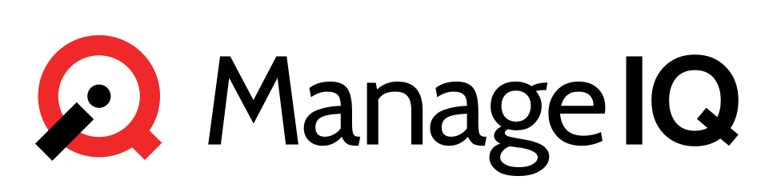

## Discover, Optimize, and Control your Hybrid IT

### Manage containers, virtual machines, networks, and storage from a single platform

ManageIQ is an open-source Management Platform that delivers the insight, control, and
automation that enterprises need to address the challenges of managing hybrid
IT environments.  It has the following feature sets:

* **Insight**: Discovery, Monitoring, Utilization, Performance, Reporting, Analytics, Chargeback, and Trending.
* **Control**: Security, Compliance, Alerting, Policy-Based Resource and Configuration Management.
* **Automate**: IT Process, Task and Event, Provisioning, Workload Management and Orchestration.
* **Integrate**: Systems Management, Tools and Processes, Event Consoles, CMDB, RBA, and Web Services.

## Get Started

*  [**Download community builds** for your platform](http://manageiq.org/download/)
*  [**Fork the source** to contribute](https://github.com/ManageIQ/manageiq)
*  [**Read** the documentation](https://manageiq.org/docs)

## Learn more

*  [**Visit** our website](https://manageiq.org)
*  [**Discuss** ManageIQ with developers and power users](https://github.com/orgs/ManageIQ/discussions)
*  [**Chat** with contributors on Gitter](https://gitter.im/ManageIQ/manageiq)
*  [**Submit** bug reports and feature requests on GitHub](https://github.com/ManageIQ/manageiq/issues?state=open)
*  [**Watch** some of our videos](https://www.youtube.com/user/ManageIQVideo)
